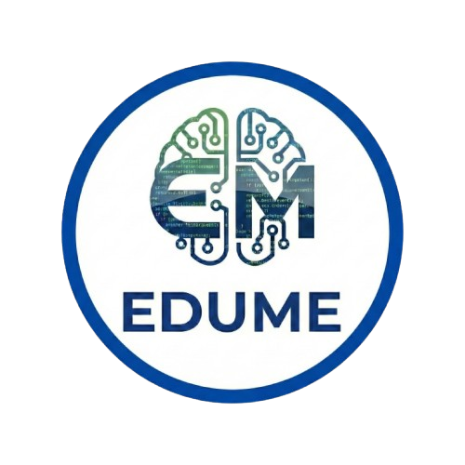

<div align="center">
  
  <h1>EduMe 🎓</h1>
  <p><strong>A Next-Generation Interactive E-Learning & Gamification Platform</strong></p>
  
  [](https://php.net/)
  [](https://www.mysql.com/)
  [](https://developer.mozilla.org/en-US/docs/Web/JavaScript)
  [](https://vark-learn.com/)
</div>

<br />

## 📖 Introduction

**EduMe** is a fully customizable, data-driven e-learning management system built from the ground up to support dynamic, personalized learning paths. Moving away from traditional "one-size-fits-all" learning, EduMe curates its user experience using the **VARK pedagogical model**. Whether you are a visual learner or a hands-on coder, EduMe dynamically surfaces the best content variant for you. 

Beyond personalized learning, EduMe offers robust administrative controls, integrated gamification (streaks & achievements), and real-time interactive sandboxes for coding exercises.

---

## ✨ Core Features Detailed

### 🧑‍🎓 For Students
* **VARK Personalized Learning Pathways**: Upon registration, students take an embedded questionnaire to determine their learning style (`Visual`, `Aural`, `Read/Write`, `Kinesthetic`). The dynamic dashboard and course detail pages will then intelligently prioritize specific UI components (like audio podcasts for Aural learners, or code sandboxes for Kinesthetic learners).
* **Interactive Coding Sandbox**: Practice code (`Python`, `HTML`, `CSS`, `JS`) directly in your browser with our integrated `CodeMirror` sandbox. No local environments required!
* **Gamified "Smart Feed"**: Real-time tracking of your achievements, course progress milestones, and daily login streaks. The dashboard intelligently recommends new courses based on your VARK tag.
* **Hybrid Preference Persistence**: Seamlessly toggle between Light and Dark themes (persisted via `localStorage` for sub-millisecond load times), alongside Email Notification settings securely synced to the MySQL `users` table.
* **Support Center Ticket System**: Directly submit issues, missing course requests, or technical bugs to instructors right from your dashboard.

### 🛡️ For Administrators
* **Secure Admin Guards**: All backend processing APIs and frontend administrative panels are strictly protected by `AdminPage` session guardrails to prevent unauthorized direct URL access.
* **Complete Course Management**: Build courses, add chapters, and upload dynamic content variants into the relational database.
* **Holistic User Management**: Review student progress, edit account security configurations, and handle tickets via the visual Support Center dashboard using asynchronous API REST calls.

---

## 🛠️ Tech Stack & Architecture

- **Frontend**: Vanilla JavaScript (ES6+), semantic HTML5, custom highly-responsive CSS (Flexbox/Grid architecture), dynamic DOM manipulation, and `CodeMirror` API for the Sandbox.
- **Backend / Routing**: **PHP 8+** executing under an Object-Oriented paradigm using bespoke View Controllers (`AuthController`, `PageGuard`, `Database`).
- **Database Layer**: **MySQL** interacting securely via **PHP Data Objects (PDO)** utilizing prepared statements to inherently prevent SQL Injection arrays.
- **Security Defenses**: XSS sanitization via `htmlspecialchars()`, API input validation, and secure session management via robust `session_destroy()` methodologies linking back to absolute `BASE_URL` logic.

---

## 📂 Project Directory Framework

The codebase strictly enforces the separation of authenticated scopes, configuration, and modular capabilities:

```text
Edume/
├───admin/               # 🛡️ Secure Admin Control Panel
│   ├───course_manage/   # API endpoints and UI for Course CRUD operations
│   ├───dashboard/       # Admin analytics summary and overview
│   ├───profile/         # Admin credential and settings management
│   ├───support_center/  # Admin view of incoming support tickets
│   └───user_manage/     # Data grid manipulating the `users` database table
│
├───config/              # ⚙️ Application Globals and Engine Connectors
│   ├───constants.php    # Defines global constants like `BASE_URL`
│   ├───Database.php     # Singleton PDO Database initiator class
│   └───Guards/          # Middleware classes isolating Student vs Admin traffic
│
├───CSS/                 # 🎨 Global Cascasing Style Sheets (Unified Design System)
├───JS/                  # 🧠 Global JavaScript utility functions and AJAX controllers
│
├───database/            # 🗄️ Database Initialization
│   ├───edume_merged_schema.sql  # Database Table Structural definitions
│   └───seed.sql                 # Mock initialization data (Users, Courses)
│
├───public/              # 🌐 Unauthenticated Visitor Workflows
│   └───registration/    # Session registration, Login verification, and Logout termination
│
├───student/             # 🎓 Student Portal Capabilities
│   ├───coding/          # The integrated CodeMirror Kinesthetic environment
│   ├───course/          # Unified course library explorer
│   ├───course_details/  # The VARK-rendered logic reading from `chapters`
│   ├───dashboard/       # Student overview (Smart Feed, Streaks, Analytics)
│   ├───profile/         # Profile overview and hybrid settings mutations
│   └───questionnaire/   # VARK Quiz mapping mechanics
│
└───image/ & material/   # 🖼️ Static content delivery bins (Icons, PDFs, Docs)
```

---

## 🏗️ Database Setup & Schema Map

The `edume` platform requires a relational structured mapping encompassing several pivotal tables configured with Foreign Key constraints:
1. `users` - Encompasses credentials, `role` enums (`admin`/`student`), VARK `learning_style`, and `current_streak`.
2. `courses` - Top-level academic topics.
3. `chapters` - Structured curriculum chunks logically bound to `course_id`.
4. `content_materials` - The actual media payload (Text, PDF bytes, Video paths).
5. `user_progress` - Cross-reference table tracking what `chapter_id` a `user_id` has interacted with.
6. `reports` - Central logging tracking feedback from students.

---

## 🚀 Quick Start & Installation Guide

Follow these steps to deploy EduMe on your local or remote server environment:

1. **Prerequisite Requirements**: 
   Ensure you have a standard **LAMP / WAMP / XAMPP** stack running locally with PHP v7.4+ and MySQL v8.0+.
   
2. **Clone the Repository**:
   Navigate into your server web-root (e.g. `c:/xampp/htdocs/`) and clone this codebase.
   ```bash
   git clone https://github.com/tjunjie1408/CP_Edume.git
   ```

3. **Database Initialization**:
   - Access your database manager (such as `phpMyAdmin` or raw MySQL CLI).
   - Create a blank database named exactly: `edume`
   - Import the structural schema by executing `database/edume_merged_schema.sql`
   - Import the structural mockup payloads by executing `database/seed.sql`

4. **Environment Initialization**:
   Ensure `config/constants.php` points exactly to where your application rests via the `BASE_URL` definition. By default, it expects:
   ```php
   define('BASE_URL', '/Edume');
   ```

5. **Execute and Validate**:
   - Open your browser to `http://localhost/Edume`
   - **Student Mock Account**: Log in via `student@example.com` | Password: `password123`
   - **Admin Mock Account**: Log in via `admin@example.com` | Password: `adminpass`

---
> *Architected out of a passion to redefine interactive technology education.*
